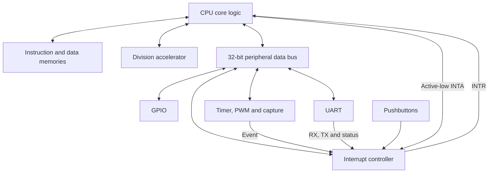

# RISC-V MCU with Memory-Mapped Peripherals

A VHDL microcontroller project that integrates a 32-bit RISC-V-based processor with GPIO, a programmable timer, PWM and input capture, UART communication, a prioritized interrupt controller, and a multicycle division accelerator.

Developed for **Advanced CPU Architecture & Hardware Accelerators** at **Ben-Gurion University of the Negev**, targeting the **Intel Cyclone V 5CSXFC6D6F31C6** on the **DE10-Standard** board.

The project brings together processor datapath design, peripheral integration, interrupt handling, hardware/software interfaces, simulation, and FPGA implementation.

| At a glance | Details |
| --- | --- |
| RTL | VHDL, including VHDL-2008 constructs |
| Architecture | Single-cycle CPU datapath with multicycle division and interrupt entry |
| Memory | Separate 8 KiB instruction and 8 KiB data memories |
| Peripherals | GPIO, timer, PWM, capture, UART, interrupt controller |
| Tools used in the project | Quartus Prime 25.1 Standard, ModelSim, Signal Tap |
| Reported operating clock | 25 MHz MCLK |
| Reported full-MCU results | 2,017 ALMs; 1,743 registers; 29.09 MHz MCLK Fmax |

The implementation uses an educational instruction subset and a custom interrupt mechanism. The `RV32IM_CORE` entity name does **not** imply complete RV32IM or privileged-architecture compliance. See [Implementation scope](#implementation-scope).

## Architecture

[`MCU.vhd`](DUT/MCU.vhd) connects the processor and peripherals. [`MCU_top.vhd`](DUT/MCU_top.vhd) provides the board-facing wrapper, while [`tb_MCU.vhd`](TB/tb_MCU.vhd) instantiates the MCU with additional observation signals.



The diagram shows functional connections. The instruction memory, data memory, and divider are instantiated within the processor hierarchy.

### Processor and arithmetic

- **Instruction fetch:** program counter, instruction memory, branch/jump selection, and PC hold control.
- **Instruction decode:** 32-register file, immediate generation, and operand selection.
- **Execution:** arithmetic, logic, shifts, comparisons, branch decisions, and address generation.
- **Multiplication:** a datapath built from four 8-bit partial products, using the lower 16 bits of each operand.
- **Division:** a 32-bit unsigned restoring divider that produces quotient and remainder over 32 iteration cycles, plus control overhead.
- **Write-back:** selection among ALU, memory, multiplication, quotient, and remainder results.

The CPU holds the PC during division and writes the result after the divider completes. Interrupt acceptance is deferred while a division is in progress.

### GPIO

The GPIO block provides eight switch inputs, eight LED outputs, and six seven-segment display outputs. Each display register supplies its lower nibble to an `SSD` decoder.

At the board interface, `LEDR_o(9 downto 8)` is tied low and only `SW_i(7 downto 0)` is read by the GPIO block. The LED and display registers are write-only through this interface; switch data is readable.

### Timer, PWM, and capture

The Basic Timer includes:

- A 32-bit counter with hold and clear controls.
- Counter tick division by 1, 2, 4, or 8.
- Two programmable compare registers.
- PWM output controlled by compare events and output mode.
- Input capture from `CAPIN1` or `CAPIN2`, with rising- or falling-edge selection.
- Interrupt-event selection from compare or capture events.

In the supplied MCU integration, the timer's `SMCLK_i` port is connected to **MCLK**. Although an SMCLK input and PLL wrapper exist, the timer does not currently use the separate SMCLK signal. Capture inputs are exposed by `MCU`; the board wrapper leaves them at their default values.

### UART

The UART provides memory-mapped control, receive, and transmit registers, with:

- One start bit, eight data bits transmitted LSB-first, optional parity, and one stop bit.
- Separate receive and transmit buffers.
- Baud-rate selection between the configured base rate and 115200 baud; the MCU sets the base rate to 9600.
- Framing, parity, and overrun status.
- Receive, transmit, and status interrupt outputs.

The UART instance assumes a **25 MHz input clock**. Its `CLK_FREQ` generic must match the clock actually supplied to it. Software must release the UART software-reset bit before communication.

## Interrupt handling

The interrupt controller captures source events, applies per-source enables, and selects a vector using fixed priority. `KEY0` enters through a separate reset-request path; `KEY1`–`KEY3` provide external interrupt sources.

| Priority | Source | TYPE / vector-table byte offset |
| --- | --- | --- |
| Highest | KEY0 / reset request | `0x00` |
| 2 | UART status | `0x04` |
| 3 | UART receive | `0x08` |
| 4 | UART transmit | `0x0C` |
| 5 | Basic Timer | `0x10` |
| 6 | KEY1 | `0x14` |
| 7 | KEY2 | `0x18` |
| Lowest | KEY3 | `0x1C` |

For a normal interrupt:

1. An enabled event raises `INTR` when global interrupts are enabled.
2. The CPU enters its interrupt-control sequence and asserts **active-low `INTA`**.
3. The controller drives `TYPE` onto the data bus, and the CPU captures it.
4. The CPU uses `TYPE` to read the handler address from the vector table in data memory and saves the return PC in `tp` (`x4`).
5. The handler returns using `jalr zero, 0(tp)`, which the control unit recognizes as the project's interrupt-return operation.

Global interrupt enable combines the control unit's internal enable with `gp[0]` (`x3[0]`). Software initializes the vector table and interrupt enables. The reset request bypasses global interrupt gating.

This is a project-specific protocol; it does not use standard machine-mode trap CSRs or `mret`.

## Memory and peripheral map

Instruction and data memories each contain 2,048 words of 32 bits. They occupy separate address spaces. In the data path, address bit 13 selects peripheral access instead of data memory.

| Byte address | Register | Access | Purpose |
| --- | --- | --- | --- |
| `0x2000` | `PORT_LEDR` | W | Eight LEDs |
| `0x2004`, `0x2005` | `PORT_HEX0`, `PORT_HEX1` | W | Displays 0 and 1 |
| `0x2008`, `0x2009` | `PORT_HEX2`, `PORT_HEX3` | W | Displays 2 and 3 |
| `0x200C`, `0x200D` | `PORT_HEX4`, `PORT_HEX5` | W | Displays 4 and 5 |
| `0x2010` | `PORT_SW` | R | Eight switches |
| `0x2018` | `UCTL` | R/W | UART control and status; status bits are read-only |
| `0x2019` | `RXBUF` | R | UART receive buffer |
| `0x201A` | `TXBUF` | R/W | UART transmit buffer |
| `0x201C`, `0x201D` | `BTCTL1`, `BTCTL2` | R/W | Timer and capture controls |
| `0x2020`, `0x2024` | `BTCMPR0`, `BTCMPR1` | R/W | Timer compare values |
| `0x2028` | `BTCAPR` | R | Captured counter value |
| `0x202C` | `IE` | R/W | Interrupt enables |
| `0x202D` | `IFG` | R/W | Interrupt flag register |
| `0x202E` | `TYPE` | R | Selected interrupt vector offset |

These are the canonical project addresses. Peripheral decoders use selected address bits, so some addresses have aliases. The assembly maps also define `PORT_PB` at `0x2014`, but the supplied MCU does not implement a readable pushbutton port there; pushbuttons feed the interrupt controller directly.

The peripheral interface uses a 32-bit bus even for adjacent byte-addressed registers. Software and simulators must account for this custom access convention; ordinary word-alignment assumptions do not cover every address in this map.

## Repository contents

| Path | Contents |
| --- | --- |
| [`DUT/`](DUT/) | CPU, MCU integration, peripherals, packages, memory and PLL wrappers |
| [`TB/`](TB/) | CPU, MCU, GPIO, timer, interrupt-controller, divider, and UART testbenches |
| [`SIM/`](SIM/) | ModelSim waveform setup scripts |
| [`Benchmark apps/`](<Benchmark apps/>) | Assembly programs and memory initialization files |
| [`QUARTUS/`](QUARTUS/) | Timing constraints, Signal Tap configuration, and archived build artifacts |
| [`DOC/pre.pdf`](DOC/pre.pdf) | Project report with architecture, FPGA results, and verification figures |

The instruction and data memory instances belong in `IFETCH.VHD` and `DMEMORY.VHD`. The MCU testbench uses those instances through the CPU hierarchy.

## Running simulations

### Requirements

- ModelSim or Questa with VHDL-2008 support.
- Intel FPGA simulation libraries, including `altera_mf`, for full-MCU simulation. Both memories instantiate `altsyncram` even when the external simulation clocks are used.
- Quartus Prime with Cyclone V support for FPGA builds.

### Start with the standalone UART test

Open the ModelSim/Questa Transcript with the repository root as the working directory. In a fresh simulation workspace, compile the following files in order:

```tcl
vlib work
vmap work work

foreach source {
    DUT/cond_compilation_package.vhd
    DUT/aux_package.vhd
    DUT/BidirPin.vhd
    DUT/uart_parity.vhd
    DUT/uart_debouncer.vhd
    DUT/uart_tx.vhd
    DUT/uart_rx.vhd
    DUT/uart.vhd
    TB/uart_tb.vhd
} {
    vcom -2008 $source
}

vsim work.UART_TB
add wave -r sim:/UART_TB/*
run 1 ms
```

This test checks received data, transmitted bits, the stop bit, register readback, and interrupt-flag behavior. Inspect assertion errors and confirm that the completion message is reached. Its clock continues running, so use a finite simulation duration.

### Full MCU setup

1. Set `G_MODELSIM := 1` in [`cond_compilation_package.vhd`](DUT/cond_compilation_package.vhd) to use the testbench clocks. The supplied setting is `0`, which selects PLL generation.
2. Update the `init_file` strings in [`IFETCH.VHD`](DUT/IFETCH.VHD) and [`DMEMORY.VHD`](DUT/DMEMORY.VHD). They currently contain machine-specific absolute paths. Select a matching `ITCM.hex` / `DTCM.hex` pair from one benchmark's `bin/M9K-intel/` directory.
3. Compile the packages first: `cond_compilation_package.vhd`, `const_package.vhd`, and `aux_package.vhd`. Compile the remaining DUT files in dependency order, then `TB/tb_MCU.vhd`. Compile UART parity before UART RX/TX, UART RX/TX before UART, and leaf blocks before the core and MCU.
4. Map the Intel simulation libraries, elaborate `tb_MCU`, and load `SIM/MCU/wave.do` if waveform visibility is desired.
5. Run for a bounded interval appropriate to the selected firmware and inspect both assertions and peripheral behavior.

The `.do` files under `SIM/` configure waveform views; they are not complete compile-and-test scripts.

The system testbench generates **20 MHz MCLK**, **10 MHz SMCLK**, and **100 MHz DIVCLK**. Its timer checks expect an early timer interrupt and refer to `ITCM_timer_fast.hex` in a comment; that image is not included. Select or prepare firmware whose timer period fits the testbench timeout before treating this test as a regression. For integrated UART testing, also reconcile the MCU's 25 MHz UART setting with the 20 MHz testbench clock and drive `UART_RXD_i` to a defined idle/input waveform.

## Verification and example programs

| Testbench | Included checks or stimulus |
| --- | --- |
| `BasicTimer_tb.vhd` | Directed timer, compare, PWM, and capture stimulus |
| `GPIO_tb.vhd` | GPIO reads and writes |
| `InterruptControl_tb.vhd` | Directed interrupt-controller stimulus |
| `tb_DIV.vhd` | Expected quotient/remainder checks, including zero dividend, large operands, and divide-by-zero cases |
| `uart_tb.vhd` | Assertions for serial data, buffers, status, and flags |
| `tb_MCU.vhd` | Assertions for timer and KEY1–KEY3 interrupt acknowledgments; reset and capture stimulus |
| `tb_RV32I.vhd` | CPU-level simulation harness |

The divider uses a checking procedure that reports errors rather than VHDL `assert` statements. The GPIO, timer, and interrupt-controller benches primarily provide directed stimulus for waveform inspection. In `tb_MCU`, the KEY0 assertion is commented out, so its final message alone does not establish that KEY0 was checked.

The benchmark folders provide GPIO examples, interrupt-driven I/O applications, and arithmetic code. See the application-specific readme files for their input/output behavior. Preserve each application's instruction/data image pairing, especially where data memory contains the interrupt vector table.

The project report includes ModelSim and on-board Signal Tap evidence. The commands above describe how to reproduce simulations; they are not a claim that a new regression has been executed for this README.

## Reported FPGA results

The following values are transcribed from **Section 3 of [the project report](DOC/pre.pdf)**. They describe the archived configurations, rather than a fresh build of the current source tree.

**Target:** Cyclone V `5CSXFC6D6F31C6` · **Tool:** Quartus Prime 25.1 Standard · **Timing corner:** Slow, 1100 mV, 85 °C.

| Metric | MCU with GPIO | MCU with GPIO and interrupt capability |
| --- | --- | --- |
| ALMs | 1,903 | 2,017 |
| Registers | 1,703 | 1,743 |
| Embedded memory bits | 131,072 | 131,072 |
| MCLK Fmax | 28.37 MHz | 29.09 MHz |
| Operating MCLK | 25 MHz | 25 MHz |

The report identifies a critical path from instruction-memory output through the register-file read selection to a divider operand register. These figures provide an implementation reference; reproducing timing requires the corresponding constraints, clock relationships, and build configuration.

For a new FPGA build, use `MCU_top` as the top entity, set `G_MODELSIM := 0`, and add the supplied SDC file. The archive does not include a complete `.qpf` / `.qsf` project, so device selection and board pin assignments must be supplied. With a 50 MHz input, the current PLL constants configure 25 MHz MCLK and 100 MHz DIVCLK. Recompile for the selected board and firmware before programming.

## Implementation scope

- **Instruction set:** the decoder recognizes `mul`, `div`, and `rem`, but multiplication consumes 16-bit operand slices and division uses unsigned arithmetic. Full-width RV32M multiply behavior, signed division semantics, and the complete M extension are not implemented.
- **Memory operations:** the supplied data-memory path is word-oriented. Decoding a byte or halfword opcode does not establish complete byte-enable, extraction, or sign-extension behavior.
- **Interrupts:** the vector table, `gp[0]` enable, `tp` return register, and interrupt-return encoding are custom to this project.
- **Clock crossing:** `Sync.vhd` contains one register stage per divider operand. Its presence does not establish a complete CDC handshake or CDC sign-off for operands, control, and results.
- **External inputs:** the current MCU connects KEY1–KEY3 directly to the interrupt-source inputs after polarity inversion; there is no dedicated pushbutton debouncer in that path.
- **Validation:** the included tests and report do not constitute exhaustive ISA, formal, or timing sign-off for every source revision.

## Authors and acknowledgments

This project extends the course processor framework. Source files retain their original course copyright notices.

The UART sources retain attribution to **Jakub Cabal's [uart-for-fpga](https://github.com/jakubcabal/uart-for-fpga)**, which is distributed under the MIT license. This repository includes a memory-mapped integration of that UART. Original authorship and applicable license notices should be preserved; the UART license does not establish a license for the entire course project.
